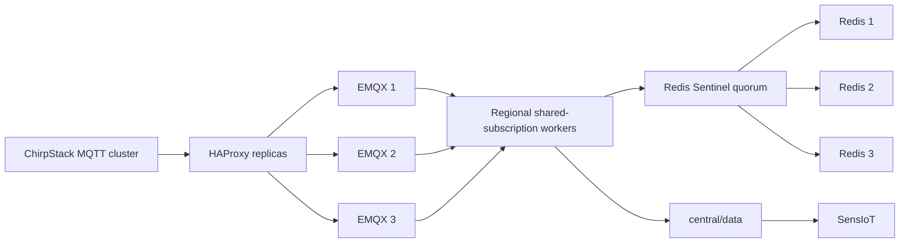

# SensIoT Fog Swarm

This directory deploys the horizontally scalable fog layer to a three-node
Linux Docker Swarm. It includes:

- two fog-worker replicas for each LoRaWAN region;
- MQTT shared subscriptions and rolling worker updates;
- three stateful EMQX members, one pinned to each labeled node;
- two HAProxy ingress replicas on separate nodes;
- a three-node Redis replication group with three Redis Sentinels;
- Docker Secrets for MQTT, Redis, EMQX credentials, and mTLS keys;
- Docker Configs for EMQX ACLs and HAProxy configuration;
- an encrypted, attachable `sensiot-edge` overlay network.

## Architecture



## Requirements

- Three Linux Docker hosts reachable from each other.
- Docker Engine versions kept aligned across all nodes.
- The nodes must allow Swarm traffic: TCP `2377`, TCP/UDP `7946`, and UDP
  `4789`.
- A registry reachable by all nodes for the custom fog-worker image.
- Prefer three manager nodes so manager quorum survives one manager failure.
- Persistent backups for all Redis data volumes.

Docker Desktop may be used as a client through a Docker context, but the
three-node evaluation should run on Linux VMs or physical Linux hosts.

## 1. Initialize And Join

On the first Linux host:

```bash
docker swarm init --advertise-addr <node-1-ip>
docker swarm join-token manager
```

Run the printed join command on nodes 2 and 3. Promote them to managers when
testing manager high availability:

```bash
docker node promote <node-2> <node-3>
```

From Windows, select a Docker context connected to a manager before running the
project scripts:

```powershell
docker context use <manager-context>
docker node ls
```

## 2. Label Storage And Ingress Nodes

From the repository root:

```powershell
.\swarm\configure-swarm-nodes.ps1 `
  -Node1 <node-1> `
  -Node2 <node-2> `
  -Node3 <node-3>
```

The labels deliberately pin each EMQX data volume to one node. Each node also
owns one Redis data volume and one Sentinel state volume. Nodes 1 and 2 receive
host-mode MQTT and dashboard ingress.

## 3. Generate Secrets And Certificates

The setup script is idempotent: existing credentials are preserved and only
missing values, including `FOG_REDIS_PASSWORD`, are generated.

```powershell
.\setup-security.ps1
.\generate-mqtt-certificates.ps1
```

The deployment script copies the required values into encrypted Swarm secrets.
It never prints their contents. Existing Swarm secrets are not overwritten
because Docker Secrets are immutable. Certificate secrets include a hash in
their names, so `-RotateLeaves` followed by a redeployment rolls services onto
new immutable certificates without deleting the previous secrets. The CA
signing key is never uploaded to Swarm.

## 4. Publish The Worker Image

Use a registry name with an immutable version tag:

```powershell
.\swarm\build-push-fog-image.ps1 `
  -Image registry.example.edu/sensiot/fog-node:2026.07.25

.\swarm\build-push-autoscaler-image.ps1 `
  -Image registry.example.edu/sensiot/fog-autoscaler:2026.07.25
```

Every Swarm node must be able to authenticate to and pull from this registry.

## 5. Deploy

Stop the local fog Compose stack if it uses the same hosts and ports:

```powershell
cd .\fog-nodes
docker compose down
cd ..
```

Deploy from a manager:

```powershell
.\swarm\deploy-fog-swarm.ps1 `
  -FogImage registry.example.edu/sensiot/fog-node:2026.07.25 `
  -AutoscalerImage registry.example.edu/sensiot/fog-autoscaler:2026.07.25
```

The preflight rejects deployment unless it finds three ready nodes, all required
state labels, and two ingress-labeled nodes.

To validate the selected manager context without creating or changing Swarm
resources:

```powershell
.\swarm\deploy-fog-swarm.ps1 `
  -FogImage registry.example.edu/sensiot/fog-node:2026.07.25 `
  -AutoscalerImage registry.example.edu/sensiot/fog-autoscaler:2026.07.25 `
  -ValidateOnly
```

## Dynamic Fog Autoscaling

The stack includes `fog-autoscaler` and a private `docker-socket-proxy`. The
proxy exposes only the Docker services API and is reachable only from the
internal `autoscaler_control` overlay. The controller additionally rejects any
service outside the four regional worker names and verifies the Swarm stack
label before updating a replica count.

The autoscaler starts in dry-run mode. First connect the existing central
Prometheus instance to `sensiot-edge`:

```powershell
cd .\Visualization
docker compose `
  -f docker-compose.yml `
  -f docker-compose.swarm-edge.yml `
  up -d prometheus
cd ..
```

Observe decisions before enabling mutations:

```powershell
docker service logs -f sensiot-fog_fog-autoscaler
```

After validating thresholds under simulator load, redeploy with:

```powershell
.\swarm\deploy-fog-swarm.ps1 `
  -FogImage registry.example.edu/sensiot/fog-node:2026.07.25 `
  -AutoscalerImage registry.example.edu/sensiot/fog-autoscaler:2026.07.25 `
  -EnableAutoscaling
```

The default policy is:

| Setting | Default |
|---------|---------|
| Evaluation interval | 30 seconds |
| Prometheus rate window | 2 minutes |
| Minimum replicas | 2 |
| Maximum replicas | 8 |
| Target rate per replica | 20 messages/second |
| Outbox scale-up threshold | 10 messages |
| Scale-up stabilization | 2 evaluations |
| Scale-down stabilization | 5 evaluations |
| Cooldown after scaling | 120 seconds |
| Maximum scale-up step | 2 replicas |
| Maximum scale-down step | 1 replica |

Scale-up uses regional `received_messages_total` rate and the durable Redis
outbox backlog. Scale-down requires a zero backlog and sustained low traffic.
Missing or ambiguous Prometheus data causes no scaling action.

Prometheus records regional rates and outbox backlog and alerts when the
autoscaler reports errors or the fog outbox has a sustained backlog.

## 6. Provision MQTT Accounts

Create an SSH tunnel to port `18084` on an ingress node, then run the security
provisioner against the local end of the tunnel. The script refuses to send
credentials over non-loopback HTTP. An HTTPS reverse proxy is also acceptable.

```powershell
ssh -L 18084:127.0.0.1:18084 <user>@<ingress-node>
.\apply-security.ps1 -FogBaseUrl http://localhost:18084/api/v5
```

The ChirpStack EMQX services and SensIoT MQTT clients must be connected to the
attachable `sensiot-edge` overlay, or configured to use an ingress-node address
and port `2883`. The internal endpoint is `fog-haproxy:8883`; both endpoints
require a CA-signed client certificate and MQTT credentials.

## Container Hardening

Fog workers, HAProxy, Redis, and Sentinel run as non-root with read-only root
filesystems, all Linux capabilities dropped, and `no-new-privileges`. EMQX
runs as its built-in non-root user with capabilities dropped and
`no-new-privileges`; its root filesystem remains writable because EMQX keeps
runtime state in `/opt/emqx/data`. The Docker socket is exposed only through
the private, API-limited socket proxy; that manager-only service remains an
explicit privileged trust boundary.

## Operations

```powershell
docker stack services sensiot-fog
docker stack ps sensiot-fog --no-trunc
docker service logs sensiot-fog_fog-node-eu868
docker service scale sensiot-fog_fog-node-eu868=3
docker service rollback sensiot-fog_fog-node-eu868
docker service logs sensiot-fog_fog-sentinel1
docker exec <sentinel-container> sh -c 'REDISCLI_AUTH="$(cat /run/secrets/redis_password)" redis-cli -p 26379 SENTINEL ckquorum sensiot-fog'
docker exec <sentinel-container> sh -c 'REDISCLI_AUTH="$(cat /run/secrets/redis_password)" redis-cli -p 26379 SENTINEL get-master-addr-by-name sensiot-fog'
```

Redeploying the same stack file performs rolling updates. Workers use
`start-first`; stateful services use `stop-first` to avoid two processes writing
the same node-local volume.

## Current State Boundary

The three EMQX members tolerate one broker-node outage. Worker replicas can move
between any Linux nodes. Redis has one member and one Sentinel pinned to each
node; a quorum of two Sentinels can promote a surviving replica and workers
discover the new master automatically.

Redis replication is asynchronous, so a promoted replica can be missing the
latest acknowledged writes after an abrupt failure. The master requires at
least one sufficiently current replica before accepting writes, reducing but
not eliminating that window. Backups and recovery tests are still required;
Sentinel is availability control, not a backup or a consensus data store.
